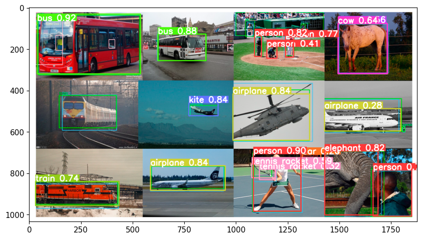

# Custom-Object-Detection-with-YOLOv5

Welcome to the YOLOv5 Custom Object Detection project! This repository demonstrates how to train and use a YOLOv5 model for detecting custom objects using annotated image datasets. The entire workflow — from data preparation and training to inference — is provided in a single, easy-to-follow Jupyter notebook.

📁 Project Structure
bash
Copy
Edit
├── yolo_custom_use.ipynb       # Jupyter notebook with full training and inference pipeline
├── datasets/                   # Folder to store your custom image dataset (train/val/images and labels)
├── runs/                       # Output folder generated by YOLOv5 during training
├── yolov5/                     # YOLOv5 model code (clone from Ultralytics repo)
└── README.md                   # Project documentation
🚀 Features
🖼️ Custom object detection using YOLOv5

🧪 Supports training on custom annotated datasets

🧠 Transfer learning using pretrained YOLOv5 weights

📊 Inference, visualization, and result export

📁 Simple folder structure for training/validation datasets

✅ Easy to follow and replicate in Google Colab

🛠️ Requirements
Install dependencies:

bash
Copy
Edit
git clone https://github.com/ultralytics/yolov5.git
cd yolov5
pip install -r requirements.txt
Recommended: Run the notebook in Google Colab

📦 Dataset Structure
The dataset should follow YOLO format:

kotlin
Copy
Edit
datasets/
├── train/
│   ├── images/
│   └── labels/
├── val/
│   ├── images/
│   └── labels/
Each image must have a corresponding .txt file with bounding box annotations.

Example annotation format:

php-template
Copy
Edit
<class_id> <x_center> <y_center> <width> <height>
All values are normalized (0.0 to 1.0).

🧪 Training
Update the data.yaml file to define your dataset path and classes.

Set parameters in the notebook (epochs, imgsz, batch_size, etc.)

Run the training cell:

bash
Copy
Edit
!python train.py --img 640 --batch 16 --epochs 50 --data data.yaml --weights yolov5s.pt --name custom_yolo
🎯 Inference
After training, use the following to run predictions on test images:

bash
Copy
Edit
!python detect.py --weights runs/train/custom_yolo/weights/best.pt --img 640 --source test_images/
Results will be saved in:

bash
Copy
Edit
runs/detect/exp/
🧠 Models
You can choose between multiple YOLOv5 variants:

yolov5s – small, fast

yolov5m – medium balance

yolov5l – large accuracy

yolov5x – extra-large

📊 Evaluation
YOLOv5 provides automated mAP evaluation after training. You can also test your model manually using:

bash
Copy
Edit
!python val.py --weights runs/train/custom_yolo/weights/best.pt --data data.yaml --img 640
📌 Tips
Make sure annotations are accurate and normalized.

Balance dataset (equal representation per class if possible).

Use early stopping or model checkpoint to avoid overfitting.

# Detection

